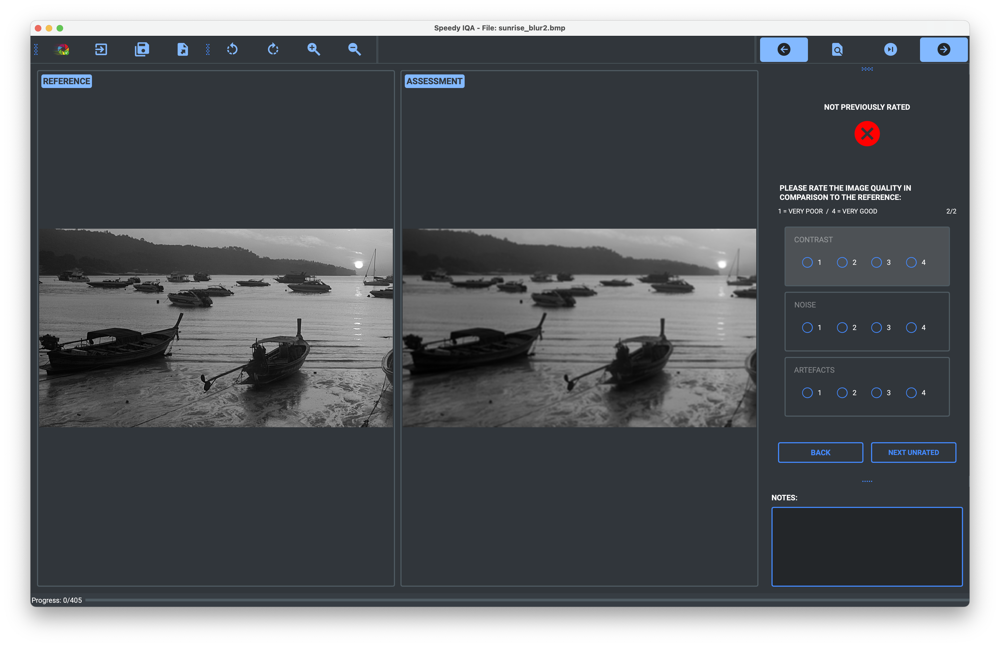

Speedy IQA for Desktop 
=====================

Speedy IQA is an image viewer and labeller for image quality assessment (IQA). The program may be
used to quickly check the quality of the images against a reference image and to label them with the required ground 
truth for developing an IQA model.

The program may be run from the command line or as an executable, which can be downloaded or 
created from the source code.

Primarily developed for use on Mac OS X, but should work on Linux and Windows.

> **Warning:** Please note that this application is still in development and there may be unresolved bugs and issues. 
> Use at your own risk!



## Table of Contents
- [Installation](#installation)
- [Usage](#usage)
  - [Selecting the Image and Reference Image Folders](#selecting-the-image-and-reference-image-folders)
  - [The Image to Reference Filename Delimiter](#the-image-to-reference-filename-delimiter)
  - [Inputs and Outputs](#inputs-and-outputs)
    - [Checkboxes](#checkboxes)
    - [Bounding Boxes](#bounding-boxes)
    - [Radiobuttons](#radiobuttons)
    - [Progress](#progress)
    - [Keyboard Shortcuts](#keyboard-shortcuts)
- [Customisation](#customisation)
  - [Configuration Wizard](#configuration-wizard)
  - [YAML File](#yaml-file)
- [Backup Files](#backup-files)
- [Executable Application](#executable-application)

Installation
------------

Install the package using pip:

```bash
pip install git+https://github.com/selbs/speedy_iqa
```

It is recommended to install the package in a Python 3.10 virtual environment as this
version of python was used in development. However, other versions of Python 3 should still work.

You can also clone the package from GitHub and install it manually:

```bash
git clone https://github.com/selbs/speedy_iqa.git
cd speedy_iqa
pip install .
```

If you encounter issues with the installation, it is likely due to the `Qt` environment paths and further info is 
provided below in the [QT dependency issues](#qt-dependency-issues) section.

Usage
-----

Run the following command in the command line:

```bash
speedy_iqa
```

Alternatively, the app may be run from an executable (see below).

### Selecting the Image and Reference Image Folders
On loading the app and continuing through the welcome page, the setup window will allow you to select the directory
containing the images to be labelled and the directory containing the reference image. 

### The Image to Reference Filename Delimiter
You must specify the delimiter to go from the image name to the reference name. This is how the program matches the two 
images up for comparison. For example, if the image name is `image_1__preprocessed.png` and the reference name is 
`image_1.png`, then the delimiter would be `__` (double underscore). The delimiter is used to find the reference image 
for each image in the folder. If the reference image filenames are the same as the images to be labelled, then the 
delimiter should be left blank.

### Inputs and Outputs

#### Radiobuttons

Radiobutton outputs are stored as integers in the output json file.

The radiobuttons can be selected using the keyboard (i.e. 1, 2, 3, 4) or by clicking on the buttons with the mouse. 
When inputting from the keyboard, the selected radiobutton group is highlighted. When a button is clicked, it 
automatically moves to the next group.

### Progress

Your progress through the folder of images is shown in the progress bar at the bottom of the window.

### Keyboard Shortcuts

|                                           Key                                            |       Action        |
|:----------------------------------------------------------------------------------------:|:-------------------:|
|                           <kbd>Enter</kbd> / <kbd>Return</kbd>                           | Next page / unrated |
| <kbd>←</kbd> / <kbd>B</kbd> / <kbd>Delete</kbd> / <kbd>Backspace</kbd> / <kbd>Back</kbd> |   Previous image    |
|                      <kbd>→</kbd> /<kbd>N</kbd> / <kbd>Space</kbd>                       |     Next image      |
|       <kbd>Cmd</kbd>/<kbd>Ctrl</kbd> + <kbd>→</kbd>/<kbd>N</kbd>/<kbd>Space</kbd>        | Next unrated image  |
|                  <kbd>1</kbd>, <kbd>2</kbd>, <kbd>3</kbd>, <kbd>4</kbd>                  | Select radiobutton  |
|                               <kbd>+</kbd> / <kbd>=</kbd>                                |       Zoom in       |
|                               <kbd>-</kbd> / <kbd>_</kbd>                                |      Zoom out       |
|                                       <kbd>R</kbd>                                       | Rotate images right |
|                                       <kbd>L</kbd>                                       | Rotate images left  |
|                                       <kbd>S</kbd>                                       |        Save         |
|                      <kbd>Cmd</kbd>/<kbd>Ctrl</kbd> + <kbd>Q</kbd>                       |        Quit         |

[//]: # (Note: <kbd>Cmd</kbd> + Scroll and <kbd>Shift</kbd> + Scroll are only currently available on Mac OS X.)

Backup Files
------------

Work is automatically backed up every 5 minutes, but this interval can be customised. By default, the backups are 
stored in the user's home directory (`~`) in the folder `~/speedy_iqa/backups` and up to the latest ten backups are 
stored. The number of backups, the backup interval and the backup directory can be customised in the configuration 
wizard or the `config.yml` file.


Executable Application
----------------------

The executable application may be downloaded from:
- Mac OS X:  https://github.com/selbs/speedy_iqa/releases/
- Windows: [TO DO](https://www.example_link.com)

### Creating an Executable

An executable can be created using `py2app` for Mac OS X or `py2exe` for Windows. The customised `setup_py2app_****.py`
scripts have been included for `py2app` for both 86x64 (*Intel*) and arm64 (*Apple Silicon*) architectures on OS X. 
These may work out of the box but may need some tweaking for your local environment. For example, if the libffi library 
is in a different directory (see below) or if you are using a different version of Python (3.10) to that used in 
development (e.g. a `|` operator is used to join dictionaries for example, which is new in Python 3.9, so this would need
changing for Python 3.8).

To create an executable with `py2app` on 86x64, the following command can be used from inside the `speedy_qc` directory
on a 86x64 Mac, or using an 86x64 conda environment or using Rosetta 2 on a arm64 Mac:

```bash
python setup_86x64.py py2app
```

For arm64, the following command can be used, but note that if using conda, it must be an arm64 conda environment:

```bash
python setup_arm64.py py2app
```

The finished executable will be in the `dist` folder, which can be moved to the `Applications` folder as required.

If experiencing issues with `py2app` on Mac OS X, you can run the program the terminal to see more information:

```bash
'dist_86x64/Speedy IQA.app/Contents/MacOS/Speedy IQA'
```

or alternatively compile the program in alias mode:

```bash
python setup_86x64.py py2app -A
```
In both cases, replace '86x64' with 'arm64' for the arm64 executable as necessary.

`PyInstaller` may also work to create an executable but has not been tested.

#### Creating a Universal Binary

A universal binary can be created by combining the two executables created by `py2app`. This can be done using the
`lipo` command after both executables have been created (e.g. inside arm64 and 86x64 conda environments). 
To create a universal binary for the 86x64 and arm64 executables, use the following commands:

```bash
mkdir -p "dist/universal/Speedy IQA.app/"
cp -R "dist/arm64/Speedy IQA.app/" "dist/universal/Speedy IQA.app/"
rm -rf "dist/universal/Speedy IQA.app/Contents/MacOS/Speedy IQA"
rm -rf "dist/universal/Speedy IQA.app/Contents/MacOS/Python"
lipo -create -output "dist/universal/Speedy IQA.app/Contents/MacOS/Speedy IQA" "dist/arm64/Speedy IQA.app/Contents/MacOS/Speedy IQA" "dist/86x64/Speedy IQA.app/Contents/MacOS/Speedy IQA"
lipo -create -output "dist/universal/Speedy IQA.app/Contents/MacOS/Python" "dist/arm64/Speedy IQA.app/Contents/MacOS/Python" "dist/86x64/Speedy IQA.app/Contents/MacOS/Python"
```

#### libffi

The libffi library is required for the executable to run on MacOS. This can be installed using Homebrew:

```bash
brew install libffi
```

If using a arm64 Mac, the libffi library will be installed in the `/opt/homebrew/Cellar` directory, whilst the 86x64
version will be installed in the `/usr/local/opt` directory. The `setup_86x64.py` and `setup_arm64.py` scripts
have been configured to look for the library in the `/opt/homebrew` directory. If the library is installed in a
different directory, the `setup_86x64.py` and `setup_arm64.py` scripts will need to be modified accordingly.

QT dependency issues
--------------------

A new function on initiating the program will hopefully configure the environment to ensure it uses the Qt
package installed in the virtual environment as part of PyQt6.

However, if you encounter issues with the installation, it is likely due to the `Qt` dependency and is usually a result
of:
- the environment PATH variable including another instance of Qt or an incompatible version of Qt; or
- the system failing to find the Qt libraries.

Further information may be found in the 
[PyQt5 documentation](https://www.riverbankcomputing.com/static/Docs/PyQt6/installation.html).

## Checking the PATH variable

You can check the PATH variable by running the following command in the terminal:

```console
echo $PATH
```

If you see a path to a Qt installation, you can remove it from the PATH variable by editing the `.bashrc`, `.bash_profile`,
`.zshrc`, or equivalent shell configuration file and removing the Qt path to the PATH variable.

You can add the desired QT path to the PATH variable using the following command:

```console
export PATH="/usr/lib/qt/bin:$PATH"
```
replace `/usr/lib/qt/bin` with the path to the Qt installation.

To add the path to the PATH variable permanently, you can add the command to the `.bashrc`, `.bash_profile`, `.zshrc`, or
equivalent shell configuration file with a command like:
  
```console
echo 'export PATH="/usr/lib/qt/bin:$PATH"' >> ~/.zshrc
```

To make these changes take effect, you can either restart your terminal or source your profile with a command like:

```console
source ~/.zshrc
```

## Installing Qt separately

If all else fails, you can install try installing Qt6 separately and setting the environment variables accordingly. You 
can install Qt from either their [website](https://doc.qt.io/qt-6/get-and-install-qt.html), using 
`sudo apt-get install qt6-default` on Ubuntu and other Debian-based systems, or using Homebrew on Mac.

### Installing Qt6 on Mac OS X with Homebrew

```console
/bin/bash -c "$(curl -fsSL https://raw.githubusercontent.com/Homebrew/install/HEAD/install.sh)"

brew update

brew install qt
```
or to ensure you get the version 6:
```console
brew install qt@6
```

After the installation is complete, you'll need to add the Qt binaries to your PATH. *Homebrew will 
display instructions for this at the end of the installation*, but you can also get the path using:

```console
brew --prefix qt
```

Typically, you can add it to your `.bashrc`, `.bash_profile`, `.zshrc`, or equivalent 
shell configuration file with a command like the following, Replace .zshrc with .bash_profile or another relevant file 
if you are using a different shell:

```console
echo 'export PATH="/usr/lib/qt/bin:$PATH"' >> ~/.zshrc
```
or for Apple Silicon / ARM Macs:
```console
echo 'export PATH="/usr/local/opt/qt/bin:$PATH"' >> ~/.zshrc
```

To make these changes take effect, you can either restart your terminal or source your profile with a command like:

```console
source ~/.zshrc
```
